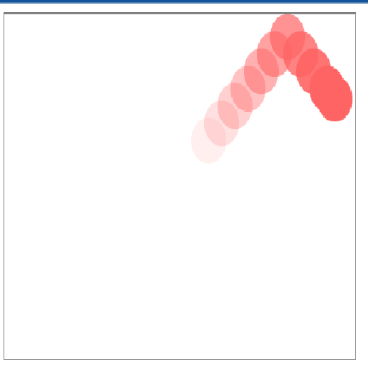
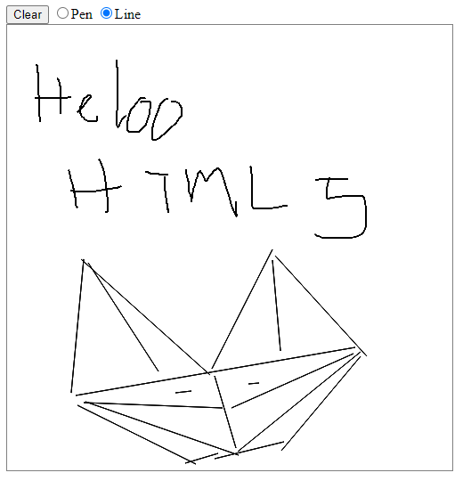
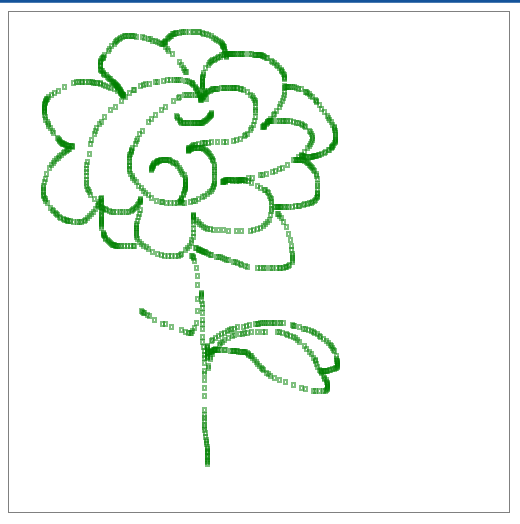

# dohoa
<!-- - bài tập đồ hoạ, sử dụng canva, html5,javascript, một số app ide hõ trợ vẽ hình bằng code -->

   
  <i> Trái bóng chuyển động liên tục</i>

   
  <i>vẽ trên web - có thể lựa chọn vẽ bằng bút hoặc kẻ đường thẳng</i>

   
  <i>vẽ nét đứt hình tròn trên web</i>

# Rắn Săn Mồi

